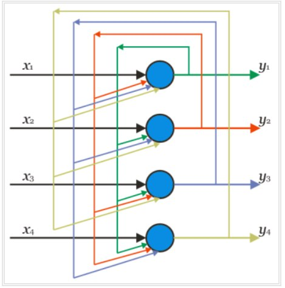
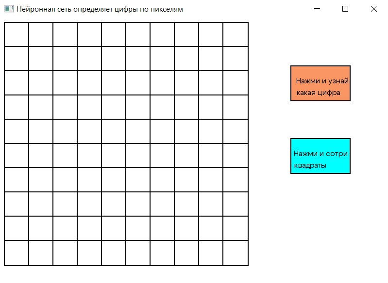
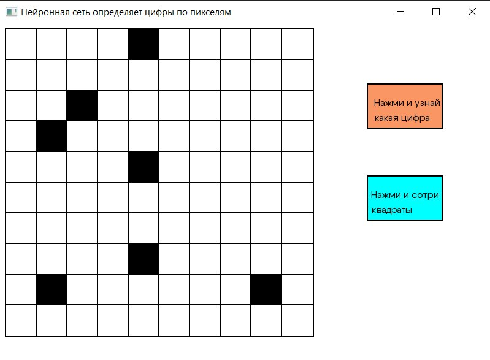
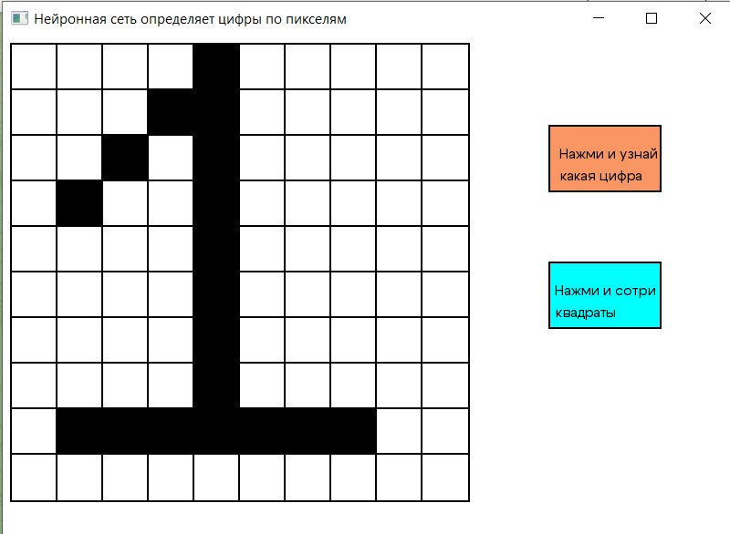
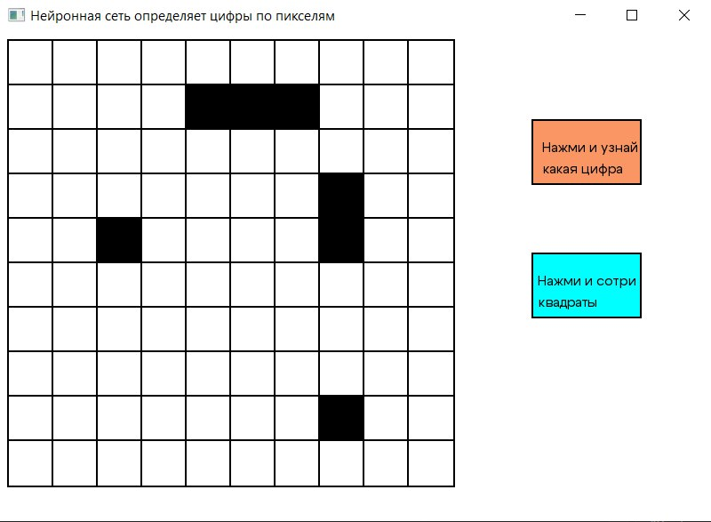
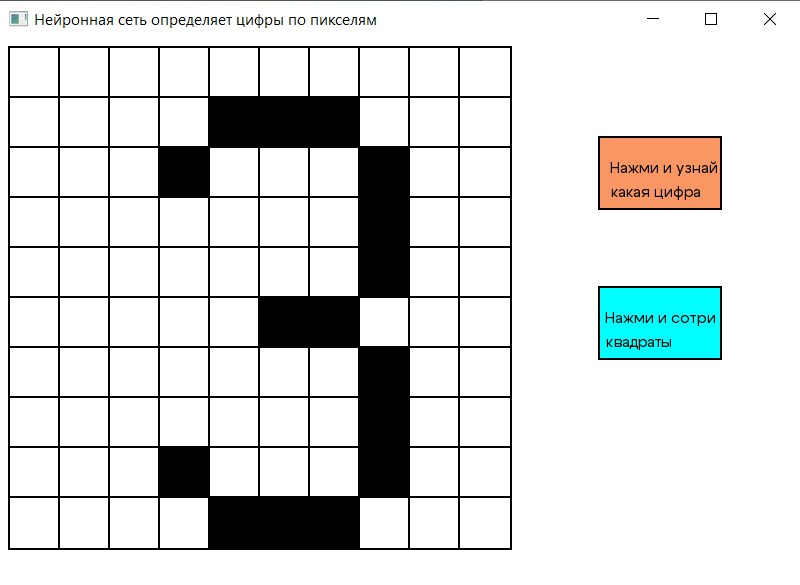

# Распознавание цифр с помощью сети Хопфилда
---
## Рекуррентная сеть и причины её создания

По архитектуре связей _Искусственные нейронные сети_ могут быть сгруппированы на два класса:
1. Сети прямого распространения
2. Рекуррентные сети

Сети прямого распространения являются статическими: на заданный вход они вырабатывают одну совокупность выходных значений, неизменных от времени и не зависящих от предыдущего состояния сети.

Сети прямого распространения имеют ограничения: 
* Все сигналы в сети распространяются только от входа к выходу
* Сеть предполагается послойной-полносвязной

Значение выходов нейронов зависят только от входного вектора и не меняются во времени, если вход изменен. Моделирование динамических процессов на таких сетях возможно только приемами, например, когда сетью на каждом шаге прогнозируется малое изменение состояние для исследуемого динамического объекта.

Для расширения диапазона решаемых задач были созданы сети с обратными связями (_рекуррентные сети_).

## Сеть Хопфилда
Рассмотрим однослойную сеть с обратными связями, состоящую из _n_ входов и _n_ нейронов. Каждый вход связан со всеми нейронами. Так как входы сети заново подаются на входы, то yi - это значение i-го выхода, который на следующем этапе функционирования сети становится i-м входом. 

Сеть состоит из единственного слоя нейронов, число которых является одновременно числом входов и выходов сети. Каждый нейрон связан синапсами со всеми остальными нейронами, а также имеет один входной синапсис, через который осуществляется ввод сигнала. Выходные сигналы, как обычно, образуются на аксонах.

Сети с обратными связями используют в качестве ассоциативной памяти. __Это означает, что по вектору, поданному на вход, сетью будет создан на выходе один из запомненных ранее векторов, наиболее "похожий" на данный входной вектор.__

## Реализация сети

Чтобы сеть могла провести распознавание и не выдать на выходе несуществующий образ, необходимо учитывать ограничение возможности сети. Для сети Хопфилда  чисто запоминающихся образов m не должно превышать величины, примерной равной __0,15n__. А для слишком похожих образов, нужно большее количество совпавших пикселей. 
То есть для картинок 10 на 10 пикселей, наибольшее количество образов, которое сможет распознать сеть Хопфилда, является 15. Я в своей работе использовала 11. 

Для считывания черно-белых пикселей и записи их в вектор, был создан класс Reading. В конструкторе он получает картинку 10 на 10 пикселей в формате .bmp, считывает значение пикселей и записывает в вектор. Так как вектор получается __зеркальный__, пришлось добавить циклы для правильного распознавания.  

    Reading(const char* filename, int* width, int* height) {
		
		vector_t bmp;
		FILE* f;
		fopen_s(&f,filename, "rb");
		
		if (f == NULL) {
			std::cerr << "Файл не найден!" << std::endl;
			width = NULL;
			height = NULL;
		}

		unsigned char info[54];
		fread(info, sizeof(unsigned char), 54, f); // read the 54-byte header

		// extract image height and width from header
		*width = *(int*)&info[18];
		*height = *(int*)&info[22];
		int data_offset = *(int*)(&info[0x0A]);
		fseek(f, (long int)(data_offset - 54), SEEK_CUR);

		int row_padded = (*width * 3 + 3) & (~3);
		unsigned char* data = new unsigned char[row_padded];
		unsigned char tmp;

		for (int i = 0; i < *height; i++)
		{
			fread(data, sizeof(unsigned char), row_padded, f);
			for (int j = 0; j < *width * 3; j += 3)
			{
				tmp = data[j];
				data[j] = data[j + 2];
				data[j + 2] = tmp;

				data[j] / 255 > 0? bmp.push_back(-1) : bmp.push_back(1);
				
			}
		}
		vector_t x;
		int h = 0;
		for (int i = 0; i < (*width) * (*height); i++) {
			++h;
			x.push_back(bmp[(*width) * (*height) - i-1]);
			if (h % 10 == 0) {
				for (int j = 0; j < (*width); j++) {
					X.push_back(x[(*width) - j - 1]);
				}
				x.clear();
			}
		}
	}

У нас 11 картинок, чтобы было удобнее, реализован конструктор индексирования. В главной функции тогда можно записать чтение картинок таким образом:

    // Ширина картинки 
	int width = 10;
	// Длина картинки
	int height = 10;
	
	Reading **X = new Reading*[N];
	
	//Массив их экземпляров класса. Наши правильные картинки	
	X[0] = new Reading("picture\\0.bmp",&width,&height);
	X[1] = new Reading("picture\\1.bmp", &width, &height);
	X[2] = new Reading("picture\\2.bmp", &width, &height);
	X[3] = new Reading("picture\\3.bmp", &width, &height);
	X[4] = new Reading("picture\\4.bmp", &width, &height);
	X[5] = new Reading("picture\\4_1.bmp", &width, &height);
	X[6] = new Reading("picture\\5.bmp", &width, &height);
	X[7] = new Reading("picture\\6.bmp", &width, &height);
	X[8] = new Reading("picture\\7.bmp", &width, &height);
	X[9] = new Reading("picture\\8.bmp", &width, &height);
	X[10] = new Reading("picture\\9.bmp", &width, &height);

Для каждого входного вектора были высчитаны веса, которые позволяют восстановить поврежденные образы. И реализована функция для сравнения вектора, подающегося пользователем,  с **Х, какой наиболее подходит, восстановить. Данная функция представлена ниже.

    vector_t recall(const vector_t& input,Reading **X, HopfieldNetwork *vectorWithVector, int maxIterations ) {
		vector_t output = input;

		int prozent[N]; // Массив процентов для сравнения
		int max_index = 0; // Индекс максимального процента
		int max = 0; // Максимальное число
		
		for (int i = 0; i < N; i++) {
			prozent[i] = 0;
			// Сравнение вектора, введенного пользователем, с векторами эталонных образов
			// Чтобы понять, к какому образу восстанавливаем картинку
			for (int j = 0; j < input.size(); j++) {
				if (input[j] == X[i]->XOutput()[j]) {
					prozent[i] = prozent[i] + 1;
				}
			}
			if (prozent[i] > max) {
				max_index = i;
				max = prozent[i];
			}
		}
		// Цикл для восстанавления поврежденной картинки
		for (int k = 0; k < maxIterations; ++k) {
			for (int i = 0; i < input.size(); ++i) {
				double net = 0;
				for (int j = 0; j < input.size(); ++j) {
					net += vectorWithVector[max_index].weights[i][j] * output[j];
				}
				output[i] = net >= 0 ? 1 : -1;
			}
		}
		return output;
    }

Восстановленный вектор появляется на интерфейсе, чтобы пользователю было удобнее видеть результаты.
Для интерфейса была использована библиотека SFML.

Пример реализации 1:

Пример реализации 3:

__Можно использовать свои картинки. Для этого они должны быть 10 на 10 пикселей, формата .bmp и имена должны совпадать с теми, которые представлены в папке picture, всего картинок должно быть 11.__
